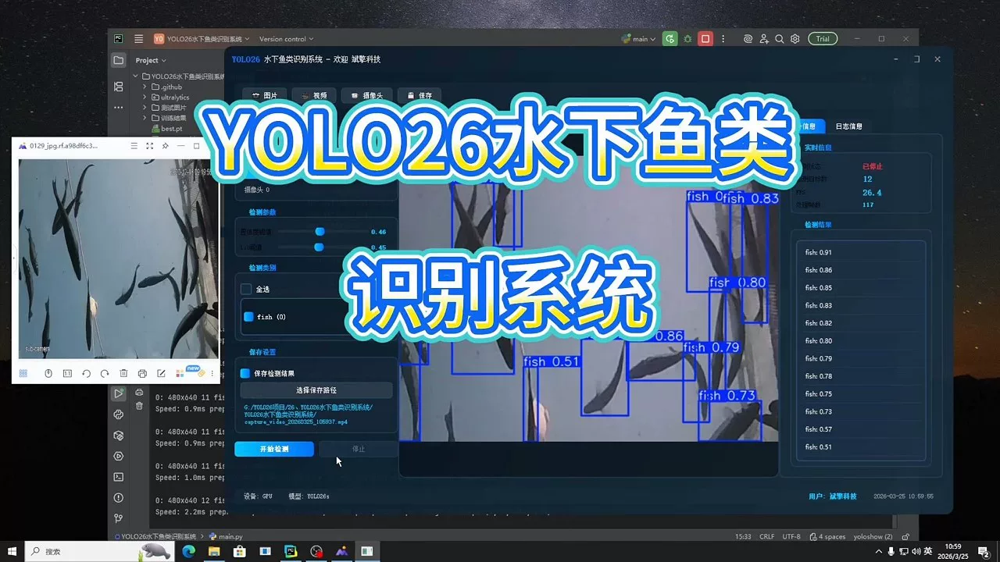
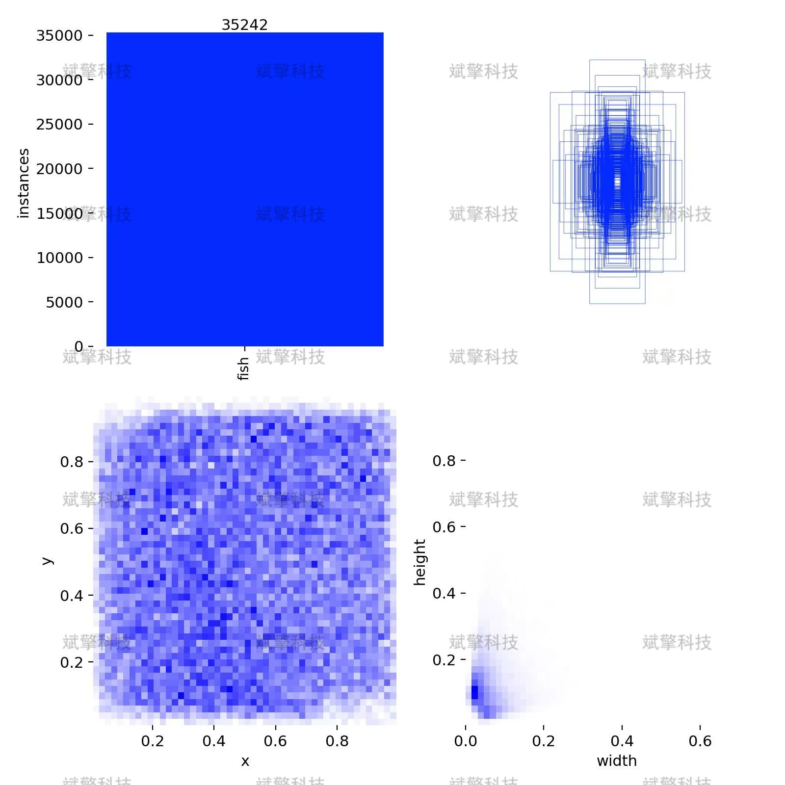
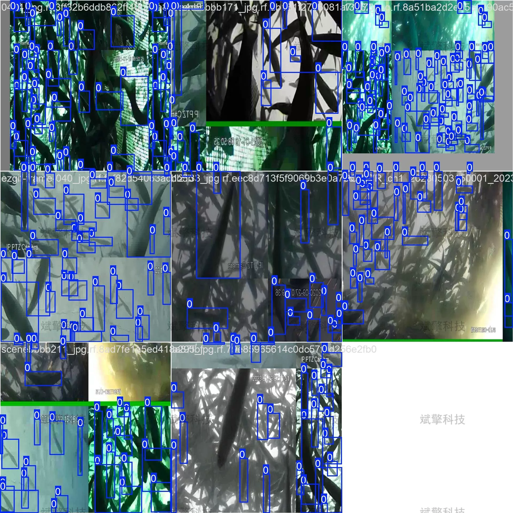
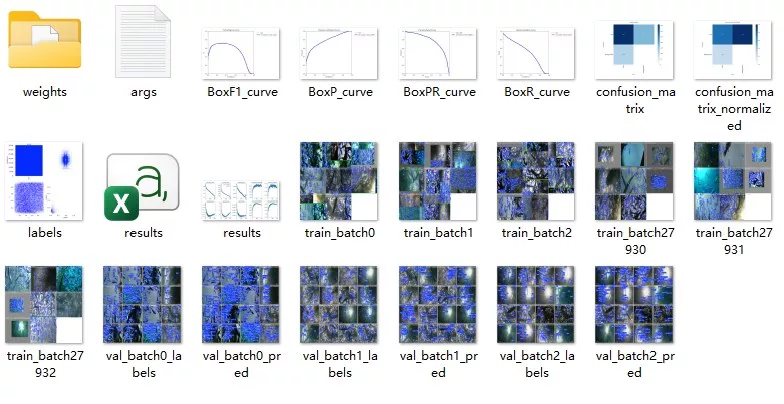
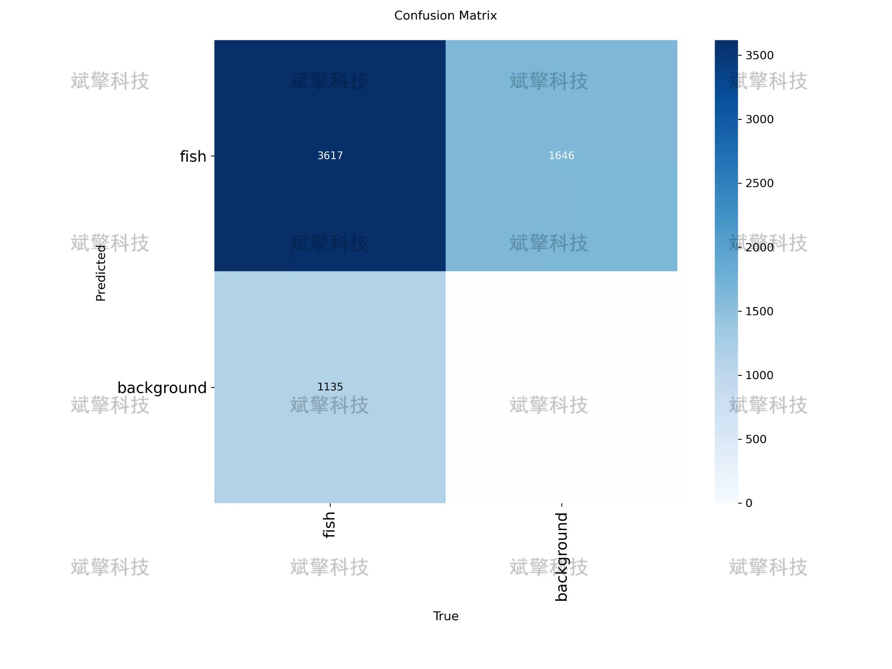
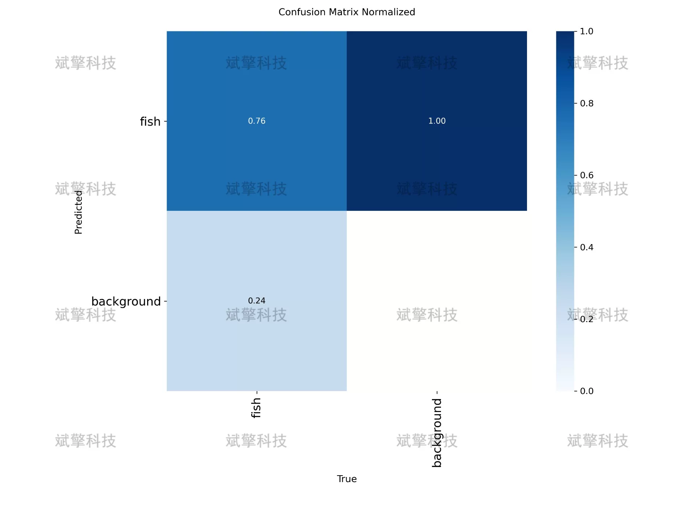
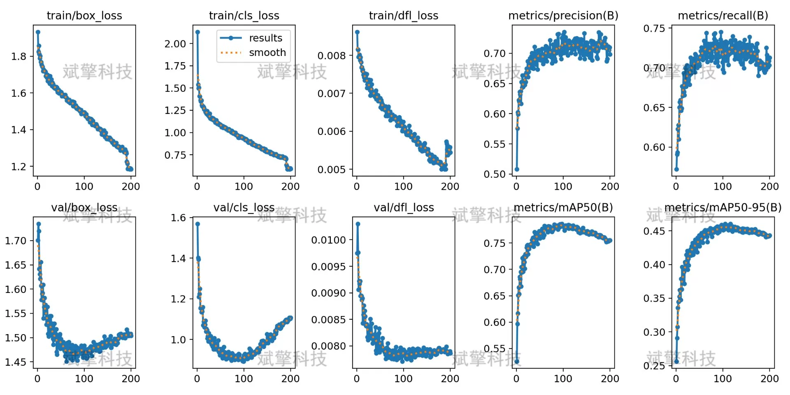
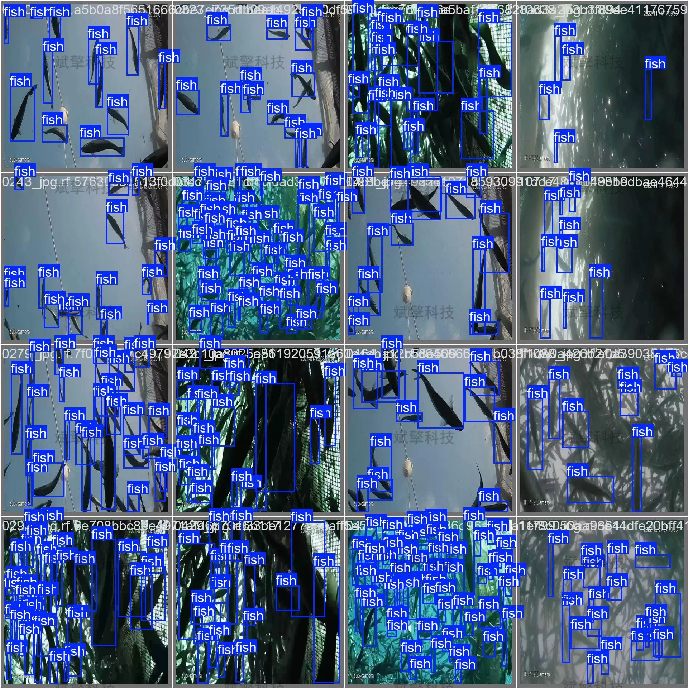
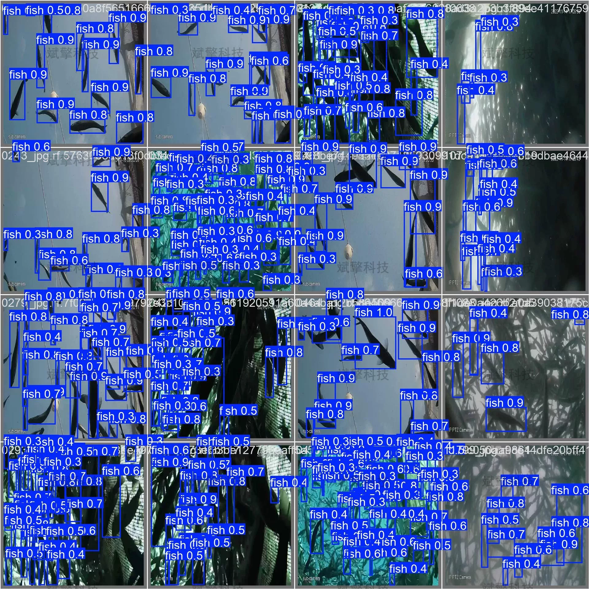

# YOLO26 Underwater Fish Identification System | Source Code

## Body

YOLO26 Underwater Fish Identification System | Source Code YOLO26 Boosts Marine Ecological Monitoring: Underwater Fish Identification System

Underwater fish identification is one of the key technologies in marine ecological monitoring and fishery resource management. This paper constructs a single-class underwater fish identification system based on the YOLO26 object detection algorithm. The system uses an underwater image dataset containing 35,242 labeled instances for training. The dataset is divided into three sets: 1170 training images, 146 validation images, and 147 test images. Experimental results show that the model achieves an average precision (mAP50) of 0.72 when the IoU is 0.5, with the highest precision reaching 1.00, effectively identifying fish targets in underwater environments. However, there is room for improvement in recall rate (76%) and bounding box positioning accuracy (mAP50-95=0.16), and there is a certain issue with background false alarms. This study provides a feasible technical solution for underwater biological monitoring and points out directions for subsequent optimization.
Training set: 1170 images
Validation set: 146 images
Test set: 147 images
Single-class target detection task, category name: ['fish']

Free reservation for remote installation. Unsuccessful refund guaranteed.
Purchase Enjoy the following resources (auto-unlocked in Baidu Cloud):
    Full source code of YOLO recognition detection project
    YOLO format datasets
    Training code + UI interface code
    Trained model + result images
    Software installation package
    Add WeChat to make a reservation for remote installation (automatically display WeChat ID after purchase) - Unsuccessful, full refund guaranteed

⚙️ Core function modules
Detection capability
    Image detection: upload and detect, return detection boxes + category information
    Video detection: supports video files, analyze each frame accurately
    Camera real-time detection: connect USB camera, realize dynamic monitoring
Interaction and control
    Target selection: freely choose one or more categories for detection
    Parameter adjustment: adjustable confidence threshold & IoU threshold, flexibly control accuracy
    Result saving: save images/video/camera detection results in one click
System and data
    User login registration: support password strength detection + encryption storage
    Log recording: automatically record operation and error information (timestamped)

## Images

## Payment

Here is a pay link on Stripe ( https://buy.stripe.com/3cs8yP7sY87d0vu9AB ). Please contact me lonlonago@foxmail.com after funding $89, and I will send you a complete data files , thank you!

